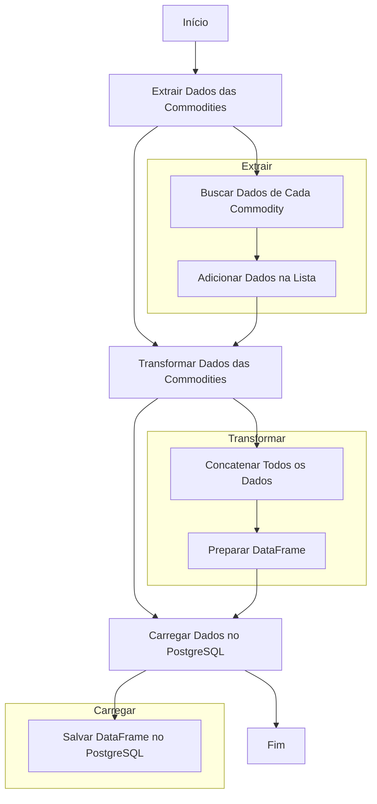

# DataWareHouse



## Configuração do Ambiente

1. Clone o repositório:

    ```bash
    git clone https://github.com/kaykesandes/Pipeline.git
    cd Pipeline
    ```

2. Crie e ative um ambiente virtual:

    ```bash
    python -m venv env
    source env/bin/activate
    ```

3. Instale as dependências:

    ```bash
    pip install -r src/requirements.txt
    ```

4. Configure as variáveis de ambiente:

    Crie um arquivo [.env](http://_vscodecontentref_/1) na raiz do projeto com o seguinte conteúdo:

    ```properties
    DB_HOST_PROD=<seu_host>
    DB_USER_PROD=<seu_usuario>
    DB_PASS_PROD=<sua_senha>
    DB_NAME_PROD=<seu_nome_do_banco>
    DB_PORT_PROD=5432
    DB_SCHEMA_PROD=public
    DB_THREADS_PROD=1
    DB_TYPE_PROD=postgresql
    DBT_PROFILES_DIR=../
    ```

5. Mova o arquivo [profiles.yml](http://_vscodecontentref_/2) para o diretório `~/.dbt/`:

    ```bash
    mkdir -p ~/.dbt
    mv profiles.yml ~/.dbt/profiles.yml
    ```

## Executando o dbt

1. Verifique a configuração do dbt:

    ```bash
    dbt debug
    ```

2. Execute os modelos dbt:

    ```bash
    dbt run
    ```

## Executando o Streamlit

1. Execute o Streamlit:

    ```bash
    streamlit run src/app.py
    ```

Substitua `https://github.com/kaykesandes/Pipeline.git` pela URL do seu repositório.
